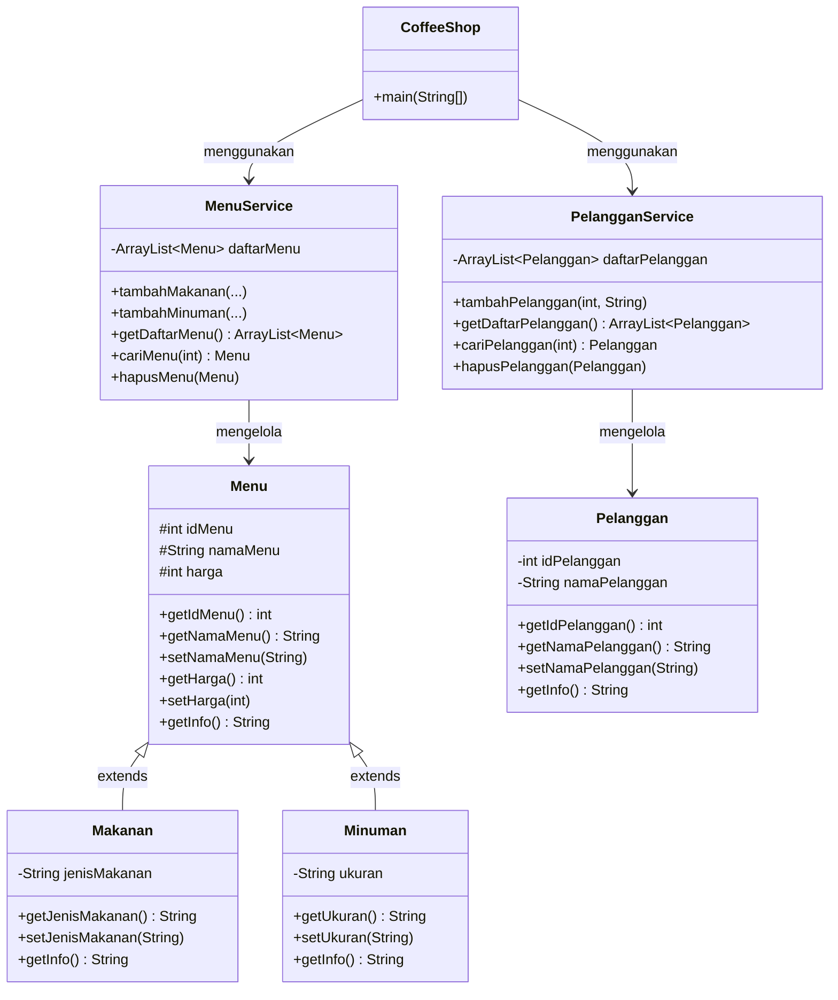

# Sistem Manajemen Coffee Shop

**Nama:** Noor Hamsyah Pratama  
**NIM:** 2509116046  
**Mata Kuliah:** Pemograman Berorientasi Objek  

---

## 1. Deskripsi Studi Kasus  

Program ini adalah aplikasi **CLI (Command Line Interface)** berbasis Java untuk mengelola data **menu** (makanan dan minuman) dan **pelanggan** pada sebuah coffee shop. Program menerapkan prinsip-prinsip OOP: **inheritance**, **encapsulation**, dan **polymorphism**, serta mendukung operasi **CRUD** (Create, Read, Update, Delete) untuk kedua entitas.

**Fitur utama:**
- Kelola Menu: tambah, lihat, update, hapus (Makanan dan Minuman)
- Kelola Pelanggan: tambah, lihat, update, hapus
- Validasi ID agar tidak ada data duplikat
- ID menu dan ID pelanggan diinput manual oleh pengguna

---

## 2. Diagram Kelas / Hierarki



**Struktur package:**

coffeeshop/  
├── model/  
│   ├── Menu.java          (superclass)  
│   ├── Makanan.java       (subclass dari Menu)  
│   ├── Minuman.java       (subclass dari Menu)  
│   └── Pelanggan.java  
├── service/  
│   ├── MenuService.java       (CRUD data Menu)  
│   └── PelangganService.java  (CRUD data Pelanggan)  
└── main/  
    └── CoffeeShop.java        (main() + tampilan CLI)  

---

## 3. Penjelasan Inheritance

Relasi inheritance ada pada `Menu` sebagai **superclass**, dengan dua **subclass**: `Makanan` dan `Minuman`.

```java
// Superclass
public class Menu {
    protected int idMenu;
    protected String namaMenu;
    protected int harga;

    public Menu(int idMenu, String namaMenu, int harga) {
        this.idMenu = idMenu;
        this.namaMenu = namaMenu;
        this.harga = harga;
    }

    public String getInfo() {
        return "[" + idMenu + "] " + namaMenu + " - Rp" + harga;
    }
}

// Subclass 1
public class Makanan extends Menu {
    private String jenisMakanan;

    public Makanan(int idMenu, String namaMenu, int harga, String jenisMakanan) {
        super(idMenu, namaMenu, harga); // memanggil constructor superclass
        this.jenisMakanan = jenisMakanan;
    }

    @Override
    public String getInfo() {
        return super.getInfo() + " | Kategori: Makanan | Jenis: " + jenisMakanan;
    }
}

// Subclass 2
public class Minuman extends Menu {
    private String ukuran;

    public Minuman(int idMenu, String namaMenu, int harga, String ukuran) {
        super(idMenu, namaMenu, harga); // memanggil constructor superclass
        this.ukuran = ukuran;
    }

    @Override
    public String getInfo() {
        return super.getInfo() + " | Kategori: Minuman | Ukuran: " + ukuran;
    }
}
```

`Makanan` dan `Minuman` **mewarisi** field `idMenu`, `namaMenu`, `harga` beserta getter/setter-nya dari `Menu` melalui `super(...)`, sekaligus menambahkan field unik masing-masing (`jenisMakanan` dan `ukuran`). Method `getInfo()` di-**override** oleh kedua subclass (contoh **polymorphism**): saat dipanggil lewat referensi bertipe `Menu`, Java otomatis menjalankan versi method sesuai objek aslinya.

---
## 4. Demo Program  
- Menu Utama Tampilan


awal program CLI yang menampilkan opsi navigasi utama: Kelola Menu (1), Kelola Pelanggan (2), dan Keluar (0).  

___

a) Menu  
- Kelola Menu Submenu


yang muncul setelah memilih "Kelola Menu", berisi 5 opsi CRUD: Tambah Menu, Lihat Semua Menu, Update Menu, Hapus Menu, dan Kembali.  

- Tambah Menu - Makanan


Makanan: ID 101, Nama Nasi Goreng Spesial, Harga 25000, Jenis Berat. Program memanggil menuService.tambahMakanan(...) yang membuat objek Makanan baru lewat constructor super(idMenu, namaMenu, harga) ke superclass Menu.  

- Lihat Semua Menu


Daftar menu ditampilkan: [101] Nasi Goreng Spesial - Rp25000 | Kategori: Makanan | Jenis: Berat. Baris ini dihasilkan dari method getInfo() yang di-override pada class Makanan.

- Update Menu Data Menu
  

dengan ID 101 diubah: nama menjadi Kentang Goreng, harga menjadi 12000, jenis menjadi Snack. Program menemukan objeknya lewat cariMenu(id), lalu mengubah nilainya langsung menggunakan setter.  

- Hapus Menu
  

dengan ID 101 dihapus dari daftar lewat menuService.hapusMenu(menuDicari), program mencetak konfirmasi "Menu berhasil dihapus!".  

- Tambah Menu - Minuman


Minuman: ID 201, Nama Espresso, Harga 18000, Ukuran Small. Kali ini objek yang dibuat adalah Minuman (subclass kedua dari Menu). Saat ditampilkan, field yang muncul otomatis berbeda dari Makanan (Ukuran, bukan Jenis), walau method yang dipanggil sama persis (m.getInfo()).

- Kembali Ke Menu Utama  


Kelola Menu untuk kembali ke tampilan menu utama. Ini menunjukkan navigasi do-while loop bekerja dengan benar. Program tidak berhenti/keluar, hanya kembali ke level menu sebelumnya sampai pengguna memilih 0 di menu paling atas untuk benar-benar keluar.  

___

b) pelanggan   
- Kelola Pelanggan


Submenu yang muncul setelah memilih "Kelola Pelanggan" dari menu utama, berisi 5 opsi CRUD: Tambah Pelanggan, Lihat Semua Pelanggan, Update Pelanggan, Hapus Pelanggan, dan Kembali.  

- Tambah Pengguna
  

Input data pelanggan baru: ID 301, Nama Budi Santoso. Program memanggil pelangganService.tambahPelanggan(301, "Budi Santoso") yang membuat objek Pelanggan baru, setelah lebih dulu divalidasi lewat cariPelanggan(id) untuk memastikan ID belum dipakai.  

- Lihat Semua Pelanggan


Daftar pelanggan ditampilkan: [301] Budi Santoso, hasil dari method getInfo() pada class Pelanggan.  

- Update Pelanggan


pelanggan dengan ID 301 diubah namanya dari Budi Santoso menjadi Andi Wijaya. Program menemukan objeknya lewat cariPelanggan(id), lalu mengubah nilainya langsung menggunakan setNamaPelanggan(...).  

- Hapus Pelanggan

Pelanggan dengan ID 301 (Andi Wijaya) dihapus dari daftar lewat pelangganService.hapusPelanggan(pelangganDicari), program mencetak konfirmasi "Pelanggan berhasil dihapus!".

- Kembali Ke Menu Utama  
  

Kelola Pelanggan untuk kembali ke tampilan menu utama, menunjukkan navigasi antar submenu bekerja dengan benar untuk kedua entitas (Menu dan Pelanggan).  

___

-  Keluar Dari Program


Dari menu utama, memilih 0 untuk keluar dari program. Program mencetak pesan penutup "Terima Kasih!!!" dan do-while loop di main() berhenti karena kondisi pilihan != 0 sudah tidak terpenuhi.

---
## 5. Validasi Input & Error Handling  
Program menangani beberapa jenis kesalahan input supaya tidak crash dan tetap memberi pesan yang jelas ke pengguna.  

a. Input bukan angka
Method bacaAngka() membungkus Integer.parseInt() dengan try-catch, sehingga kalau pengguna mengetik huruf atau simbol (bukan angka) saat program minta angka, program tidak berhenti paksa — cukup minta input ulang. 
```
static int bacaAngka() {
    while (true) {
        try {
            return Integer.parseInt(input.nextLine().trim());
        } catch (NumberFormatException e) {
            System.out.print("Masukkan angka yang valid: ");
        }
    }
}
```
  

Di menu utama, pengguna mengetik abc (bukan angka) pada prompt "Pilih Menu:". Alih-alih program berhenti dengan error, bacaAngka() menangkap NumberFormatException lewat try-catch, mencetak "Masukkan angka yang valid:", dan otomatis meminta input ulang sampai pengguna memasukkan angka yang benar.

b. ID duplikat saat menambah data  
Sebelum data baru disimpan, program mengecek dulu apakah ID sudah dipakai lewat cariMenu(id) / cariPelanggan(id). Kalau hasilnya bukan null (berarti sudah ada), data batal ditambahkan.  
```
System.out.print("ID menu: ");
int id = bacaAngka();
if (menuService.cariMenu(id) != null) {
    System.out.println("ID " + id + " sudah dipakai menu lain, menu batal ditambahkan.");
    return;
}
```
  

Menu "Nasi Goreng Spesial" ditambahkan dengan ID 101. Saat mencoba menambah menu baru dengan ID 101 lagi, cariMenu(101) menemukan objek yang sudah ada (bukan null), sehingga program menolak dan mencetak "ID 101 sudah dipakai menu lain, menu batal ditambahkan." data baru tidak jadi disimpan.

c. ID tidak ditemukan saat update/hapus  
Untuk update dan hapus, program mencari objeknya lebih dulu. Kalau cariMenu(id) / cariPelanggan(id) mengembalikan null (ID tidak ada di daftar), program memberi tahu pengguna alih-alih memproses data kosong. 
```
Menu menuDicari = menuService.cariMenu(id);
if (menuDicari == null) {
    System.out.println("Menu dengan ID tersebut tidak ditemukan!!");
    return;
}
```
  

Pada fitur Update Menu, pengguna memasukkan ID 999 yang tidak ada di daftar (yang tersedia hanya ID 101). cariMenu(999) mengembalikan null, sehingga program mencetak "Menu dengan ID tersebut tidak ditemukan!!" dan proses update langsung dihentikan (return), tanpa mencoba mengubah objek yang tidak ada.  

d. Kategori menu tidak valid  
Saat menambah menu, kategori yang dipilih harus 1 (Makanan) atau 2 (Minuman). Selain itu, proses tambah menu langsung dibatalkan.  
```
if (kategori != 1 && kategori != 2) {
    System.out.println("Kategori tidak valid, menu batal ditambahkan.");
    return;
}
```
  

Saat menambah menu, pengguna memilih kategori 5, padahal pilihan yang valid cuma 1 (Makanan) atau 2 (Minuman). Program mendeteksi ini lewat kondisi kategori != 1 && kategori != 2, mencetak "Kategori tidak valid, menu batal ditambahkan.", dan langsung return.  

e. Update dengan input kosong
Saat update, jika pengguna menekan Enter tanpa mengetik apa pun (ingin membiarkan nilai lama), program mengecek dengan isBlank() supaya data lama tidak tertimpa nilai kosong.  
```
System.out.print("Nama baru (" + menuDicari.getNamaMenu() + "): ");
String nama = input.nextLine();
if (!nama.isBlank()) menuDicari.setNamaMenu(nama);
```
  

Saat update menu ID 101, pengguna menekan Enter tanpa mengetik apa pun di semua prompt (nama, harga, jenis). Karena nama.isBlank() bernilai true untuk input kosong, kondisi if (!nama.isBlank()) tidak terpenuhi, sehingga setNamaMenu(...) tidak dipanggil, nilai lama tetap dipertahankan. Program tetap mencetak "Menu berhasil diupdate!" karena secara teknis proses update selesai dijalankan, walau tidak ada nilai yang benar-benar berubah.


