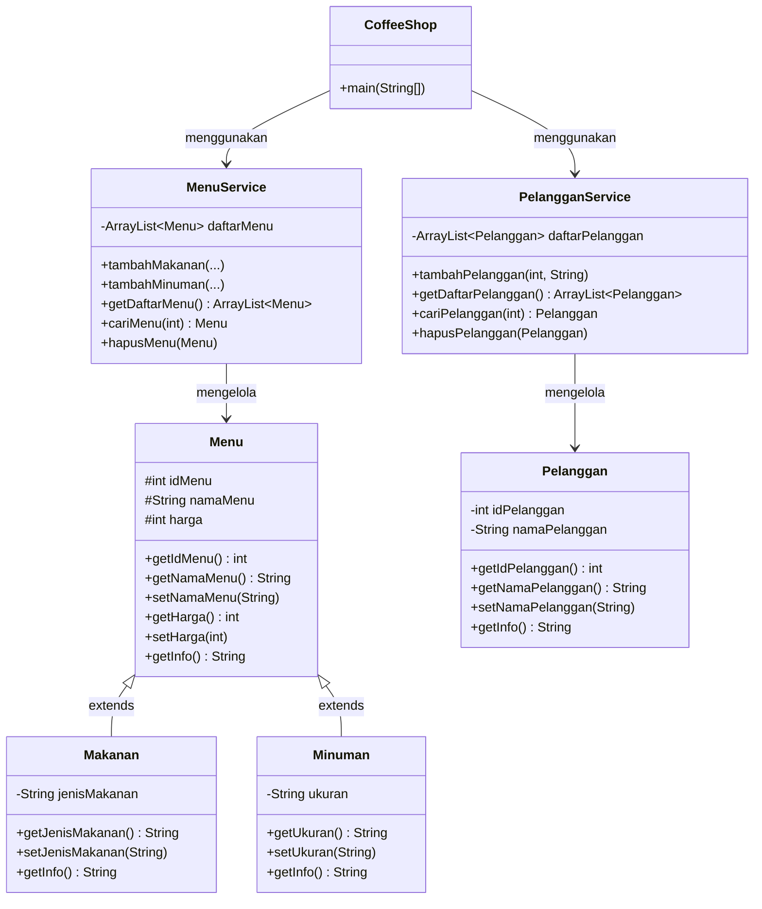

# Sistem Manajemen Coffee Shop

**Nama:** Noor Hamsyah Pratama  
**NIM:** 2509116046  
**Mata Kuliah:** Pemograman Berorientasi Objek  

---

## 1. Deskripsi Studi Kasus  

Program ini adalah aplikasi **CLI (Command Line Interface)** berbasis Java untuk mengelola data **menu** (makanan dan minuman) dan **pelanggan** pada sebuah coffee shop. Program menerapkan prinsip-prinsip OOP: **inheritance**, **encapsulation**, dan **polymorphism**, serta mendukung operasi **CRUD** (Create, Read, Update, Delete) untuk kedua entitas.

**Fitur utama:**
- Kelola Menu: tambah, lihat, update, hapus (Makanan dan Minuman)
- Kelola Pelanggan: tambah, lihat, update, hapus
- Validasi ID agar tidak ada data duplikat
- ID menu dan ID pelanggan diinput manual oleh pengguna

---

## 2. Diagram Kelas / Hierarki



**Struktur package:**

coffeeshop/  
├── model/  
│   ├── Menu.java          (superclass)  
│   ├── Makanan.java       (subclass dari Menu)  
│   ├── Minuman.java       (subclass dari Menu)  
│   └── Pelanggan.java  
├── service/  
│   ├── MenuService.java       (CRUD data Menu)  
│   └── PelangganService.java  (CRUD data Pelanggan)  
└── main/  
    └── CoffeeShop.java        (main() + tampilan CLI)  

---

## 3. Penjelasan Inheritance

Relasi inheritance ada pada `Menu` sebagai **superclass**, dengan dua **subclass**: `Makanan` dan `Minuman`.

```java
// Superclass
public class Menu {
    protected int idMenu;
    protected String namaMenu;
    protected int harga;

    public Menu(int idMenu, String namaMenu, int harga) {
        this.idMenu = idMenu;
        this.namaMenu = namaMenu;
        this.harga = harga;
    }

    public String getInfo() {
        return "[" + idMenu + "] " + namaMenu + " - Rp" + harga;
    }
}

// Subclass 1
public class Makanan extends Menu {
    private String jenisMakanan;

    public Makanan(int idMenu, String namaMenu, int harga, String jenisMakanan) {
        super(idMenu, namaMenu, harga); // memanggil constructor superclass
        this.jenisMakanan = jenisMakanan;
    }

    @Override
    public String getInfo() {
        return super.getInfo() + " | Kategori: Makanan | Jenis: " + jenisMakanan;
    }
}

// Subclass 2
public class Minuman extends Menu {
    private String ukuran;

    public Minuman(int idMenu, String namaMenu, int harga, String ukuran) {
        super(idMenu, namaMenu, harga); // memanggil constructor superclass
        this.ukuran = ukuran;
    }

    @Override
    public String getInfo() {
        return super.getInfo() + " | Kategori: Minuman | Ukuran: " + ukuran;
    }
}
```

`Makanan` dan `Minuman` **mewarisi** field `idMenu`, `namaMenu`, `harga` beserta getter/setter-nya dari `Menu` melalui `super(...)`, sekaligus menambahkan field unik masing-masing (`jenisMakanan` dan `ukuran`). Method `getInfo()` di-**override** oleh kedua subclass (contoh **polymorphism**): saat dipanggil lewat referensi bertipe `Menu`, Java otomatis menjalankan versi method sesuai objek aslinya.

---
